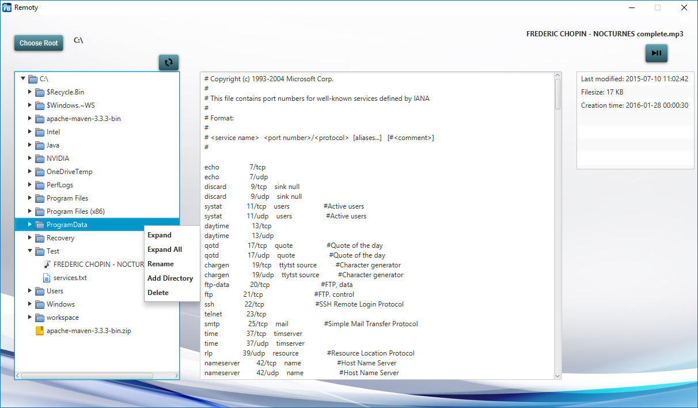

# fhj.swengb.project.remoty

###Final Project in Software Enineering Basics (SWENGB) which represents a FileExplorer written in Scala and JavaFX.
The members of the developer team are:
- Amar Bajric
- Christian Lagger
- Georg Meizenitsch

##Documentation

###Functions and Features
* TreeView
* Root can be set with a DirectoryChooser
* Icons are set for the most important file-types in the TreeCell
* Refresh button which refreshes the entire content of the TreeView
* Show attributes of files (Last modified, size, creation time)
* TextView for plain text files
* ImageView for all common image file-types
* ContextMenu for directories:
    - Expand
    - Expand All
    - Rename
    - Add directory
    - Delete
* ContextMenu for files:
    - Open (with default programme)
    - Rename
    - Delete
* Drag & Drop for moving files
* Music player for music files

###Development
- We first tried to figure out how to use a simple TreeView in order learn more about the TreeView in JavaFX.
- In the next step we were learning how to use the java.nio.File library in order to create a TreeView which shows the content of our System drive.
- In the last few steps we started to implement features like Deleting, Adding Directories, Renaming TreeItems. This has been realized with the implemented functions of the java.nio.File library and the TreeCell functions.
- In the end we also implemented minor features like images for the TreeCells and also a TextView for simple text files or an ImageView for image files.
